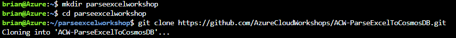

# Initial Deployments

To get started with this module, you will provision a number of resources.  The easiest way to accomplish this is to utilize the templates.  If you want to do this service by service, you can also choose that approach, it is up to you.  Perhaps you'll do the workshop a couple of times and you will do it with templates one time and manually another time.

If you are studying for any exam, I always recommend doing things a couple of ways:

- Using the Portal
- Using the Azure CLI
- Using Templates

Having experience in all of these areas will give you the advanced knowledge you might need to do well on an exam. If you just want to get going with the concepts, the quickest starting path is to use the templates.

## Utilize the templates

The templates are available in both Bicep and ARM formats. If you are just getting started with templates, I recommend Bicep.  If you are an advanced user that is used to ARM, then you can take the time to un-nest the deployall.json ARM template for extra practice.  It's up to you how deep you want to go on these concepts.

### Options

Not only can you choose which type of template to deploy, you can also deploy portions individually.  Perhaps you want to start out and you don't need to manually provision storage but you would like to do manual provisioning of the function app or the cosmos db or both.  These choices are available for you.

In addition to the templates you choose, each template has a number of parameters that you can override to change any settings you would like to modify from the default deployment.

### Scripts

In addition to the templates, there are bash scripts to execute the template deployments using the bicep files.  If you want to run a specific deployment, you can leverage the scripts directly from the azure shell and have your deployment completed in a matter of a few minutes with no work on your part.

### Deployment 

For simplicity, the easiest way to get started is just run the deploy all script.  If you want to do individual scripts, the commands will be exactly the same so you will be able to pick and choose and just run the appropriate bash script for your needs.

Finally, know that these scripts are deployments which are incremental by default, so they are idempotent.  You can run the same script 100 times if you want, and you will only get the one resource deployed in the single resource group (as long as you run with the same parameter values).  You can also mix and match, run all three, then run all, etc, likely without having any problems at all. What this means is if you come back later and run the full script, you won't cause any problems for the storage account you already provisioned (unless your settings were different - such as allowing public blob access). 

1. Get to the Azure Cloud Shell

To get started, all you need to do is clone this repo into your cloud shell.  Proceed to 

```https
https:\\shell.azure.com
```  

Make sure that you are on the correct subscription

```bash
az account show
```  

If you need to move to another subscription, list your subscriptions

```bash
az account list -o table
```

Copy the name or the subscription id and switch to it

```bash
az account set --subscription <your-id-or-subscription-name-here>
```  

1. Clone the repo

Next, create a subfolder and then clone the repo to it in your cloud shell:

```bash
mkdir parseexcelworkshop
cd parseexcelworkshop
```  

Clone the repo

```bash
git clone https://github.com/AzureCloudWorkshops/ACW-ParseExcelToCosmosDB.git
```  

  

1. Deploy All


then navigate to the templates folder and then run the command:

```bash
bash .\azuredeployall.sh
```  

