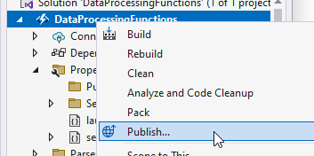
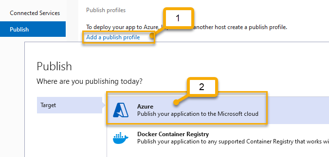
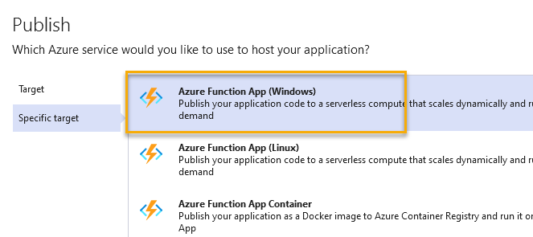
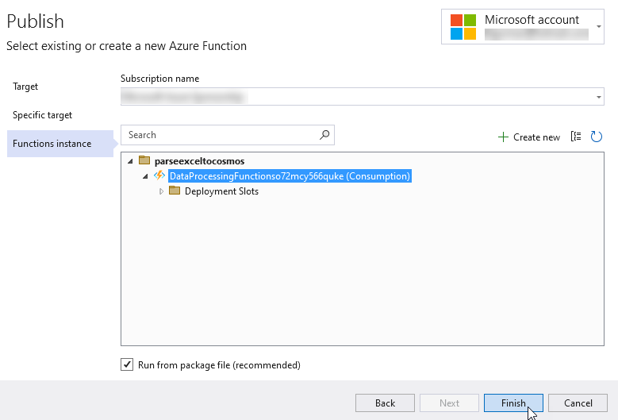
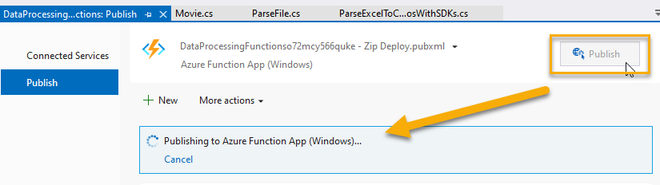
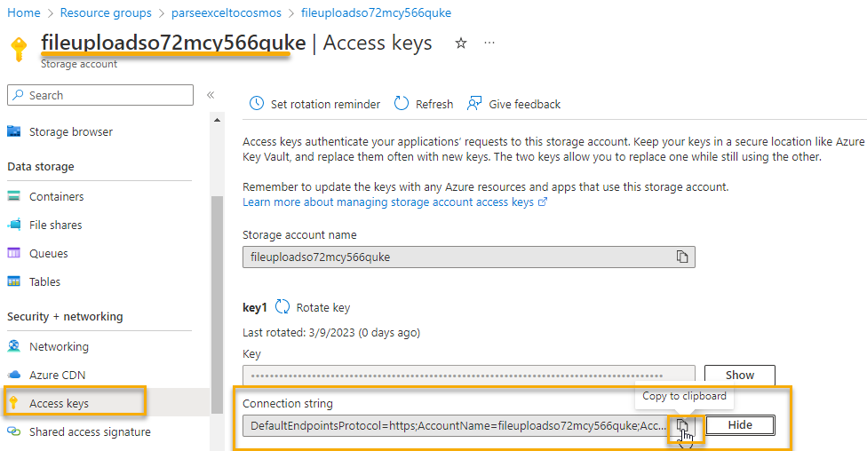
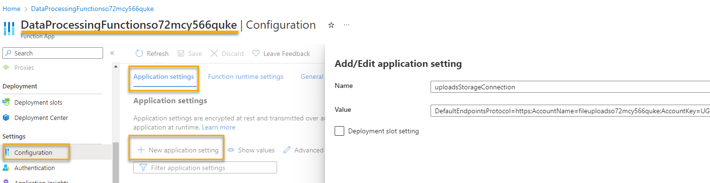
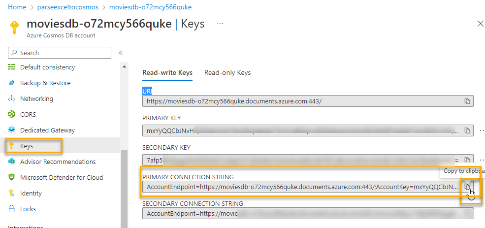
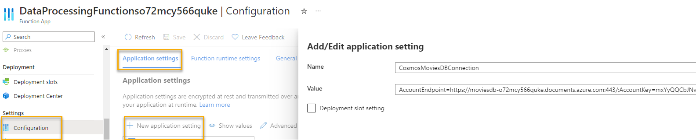
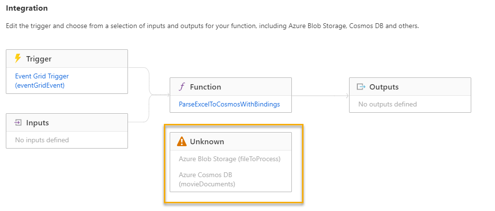

# Creating and Publishing the Function App

To get started, there are starter and solution files available for your use in the repository.  If you download or fork the code you can use the starter project with this document.  If you just want to have the solution in place, deploy the completed solution.

>**Note**: If you deploy the completed solution, you will still need to wire up the configuration information for the input and output bindings.

## Open the Starter Files

To get started, copy the starter files to a working location on your machine and open them. You'll note that even the starter files have completed the EventGrid Trigger Function.

1. Deploy the solution

    You can take the time to set up CI/CD if you would like, but to do that you'd need to create GitHub Actions on the repository, or copy the files into their own repository and set up actions there.

    The easiest solution for this workshop is to just right-click and publish the functions.

    - right-click on the project and select `Publish`

          

    - select `Add a publish profile`, then select `Azure`. 
    
          

    - select `Azure Function App (Windows)`

          

    - Make sure you are signed in to your account, then select the function app to deploy your solution, then finish the deployment

        

    - Make sure to then hit the `Publish` option to push the code to Azure

          

1. While the app deploys, review the code for the `ParseExcelToCosmosWithBindings` function

    There are a couple of particular points of interest on this function

    1) The trigger.  

        `[EventGridTrigger] EventGridEvent eventGridEvent` 

        The trigger is an EventGridTrigger, which means we'll need to set up an event that will target this function.  Because we'll already have this function deployed, that will not be difficult to accomplish as you'll see in a future step.

    2) The Blob binding:

        ```c#
        [Blob(blobPath: "{data.url}", access: FileAccess.Read,
            Connection = "uploadsStorageConnection")] Stream fileToProcess,
        ```  

        Note that this is a `Blob` binding.  The path for the blob url is part of the event data, so it can be leveraged from `data.url` (which is part of the event schema JSON, so this is not just a random setting and it is nothing you have to manually create).  

        The binding states that it needs to be able to read the blob, and uses a `connection` named `uploadsStorageConnection`.  The file is then brought in as a stream (the blob is binary after all).  The key pieces then are:

        - the included data.url from the event to leverage the blob from storage
        - the file access: read
        - the connection: `uploadsStorageConnection` 
        - the variable for code to work with the file: `fileToProcess`

    3) The output binding: 

    ```cs
    [CosmosDB(
        databaseName: "moviesdb",
        collectionName: "watchedmovies",
        ConnectionStringSetting = "CosmosMoviesDBConnection")]
        IAsyncCollector<Movie> movieDocuments,
    ```  

    The Cosmos DB binding is pointing to a database named `moviesdb` on the database `moviesdb` and the collection (container) for `watchedmovies`.  Note the important connection string setting `CosmosMoviesDBConnection` and the `movieDocuments` that will be the data to write to cosmos.  The key pieces are:

    - the name of the db and collection which are pre-created
    - the connection string setting `CosmosMoviesDBConnection`
    - the collection data to write to the Cosmos container, leveraged in code as `movieDocuments`

## Configuring the application

To complete the deployment a couple of configuration settings need to be put into place.

1. Add the connection string for the blob account

    Navigate in the portal to get your storage account connection string, which is found under the storage account in the `Access Keys` blade.  Copy the connection string to your clipboard:

      

    Once you have the connection string, navigate in another window/tab to the function app and select the `Configuration` blade.  On the configuration blade, select `+ New Application Setting` and add a new setting with the name as follows:

    ```text
    uploadsStorageConnection
    ```  

    Set the value to the connection string copied from the storage account.  Note that the name is the same name as the connection from the Blob Storage binding in the code above.

      

    Press ok, then save and continue (three clicks total to save changes). 

1. Add the connection string for the cosmos db account

    Just like the storage connection string, the binding needs to be set for the cosmos db connection string.  Navigate to your cosmos db account and get the connection string from the `Keys` blade:

      

    Copy the connection string to your clipboard, then repeat the steps to create a new configuration application setting on the Azure Function App named:

    ```text
    CosmosMoviesDBConnection
    ```  

    Set the value to the connection string for the Cosmos DB Account

      

1. The Function App is now configured

    You have already set the input and output bindings for the function app by default.

    Click on the `Functions` for the app.  Under the functions, click on the function `ParseExcelToCosmosWithBindings`

    Once in the function, click on `Integration` to see the bindings.  Unfortunately, by default they don't show their direction, so they show up as unknown.  That is ok, they will still work:

      

## Examine remaining code

The function is in place, but you can review it to see how the code will call the parse by passing the blob as a stream for parsing and using the input storage binding to connect and read the blob to a stream.

The function to parse will utilize the code to parse out the columns and build a list of movies.  The list of movies will then be published to cosmos db using the output binding.

The best news is you don't have to do anything else code-wise and the solution will just work (the SDK plumbing code is not necessary when you are using bindings)

**Note**: One callout here is the addition of an id Guid and a MovieId in the spreadsheet as well as the parsing.  Your data in a normal export might not have this.  The reason this is here is to allow point reads and utilizing the combination of the `id` string (a random Guid) and the `Title` as the partition.  This will prevent duplicates as well if the data is re-uploaded

The reason I wanted to call that out is again just because you might need to massage the export with a random Guid as an `id` string to be used by Cosmos so that you won't duplicate data if the export is happening daily or to prevent duplicates in the event of partial function failure.

## Conclusion

In this step, you made sure the function app code was deployed and you set up the connection information for the bindings.
