# Wiring up the Event Grid

Now that the Function App is in place to respond to the event, making the Event connection is pretty straightforward.

Just like anything at Azure, you can accomplish this task in multiple ways.  For instance, you can create a default event subscription manually, and then connect the dots to set the source as Blob storage and the destination as any function app, logic app, or even things like Teams channels or other third-party endpoints.

For this example, the easy route will be to leverage the Events blade in the Storage account.

## Register the service

In order to use the Azure Event Grid, you must first register the service.

The easiest way to do this is navigate to your subscription and select the `Resource Providers` blade.

1. Register the service (or validate it is registered)

    On the `Subscription` -> `Resource Providers` blade filter for `Event` to see the two services of `Microsoft.EventGrid` and `Microsoft.EventHub`.  These services are the eventing ecosystem in Azure.

    A couple of quick things:
    - You only need `Microsoft.EventGrid`.  The event hub is for big data and the event grid is for one-off events.  You can ignore EventHub for this activity.
    - Registering for a service does not cost anything.  The only time you incur charges is when you start using the service.  Feel free to turn on all the things, knowing that you won't be charged.

    For this activity, ensure that your `Microsoft.EventGrid` is registered:

    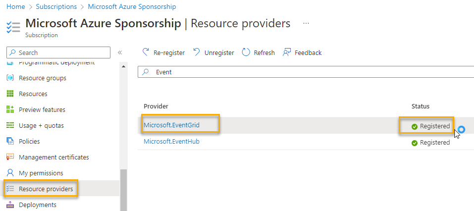  

    Alternatively, you could register the service by just running an azure CLI command in the cloud shell:

    ```bash
    az provider register -n 'Microsoft.EventGrid'
    ```  

    Then you can see if it is registered:

    ```bash
    az provider list --query "[?namespace=='Microsoft.EventGrid']" --output table
    ```  

    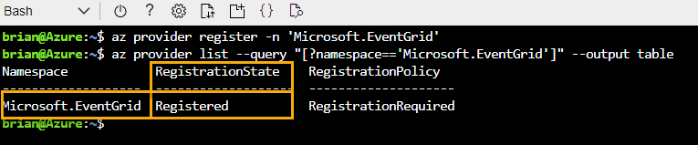  

## Create a triggered Logic App (optional - required for walkthrough 5)

If you plan to complete walkthrough 5, the easiest way to make this work well is to create the Logic App event trigger now.

The reason this is easy is because when there are no events registered, you can select the option to create either a Function App or a Logic App triggered from the event.

For the Function App trigger, the `best` way I've found is to manually add an event subscription.  Since this can be easily accomplished even after adding the Logic App and the creation of the Logic App can only be done this way on a Storage Account with no events, let's create the Logic App Event now and ignore it until later.

1. Navigate to storage and then to the events page

    On the events page, select `Logic Apps` then select `Create` on the `When a new blob is uploaded template.

    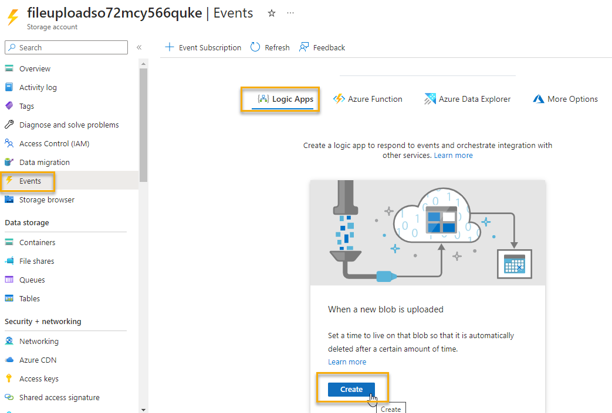  

    When the Logic App comes up, you need to connect to the storage account and to your Azure Event Grid.
    
    Connect to the storage account:  

    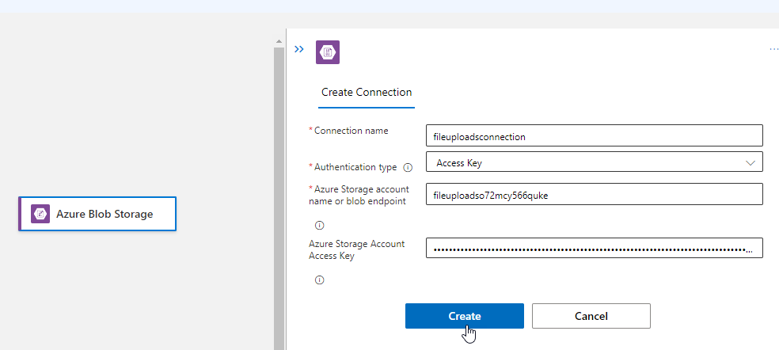

    Enter the storage account key and name to make the connection.

    Next, sign in with your user id to the Azure Event Grid:

    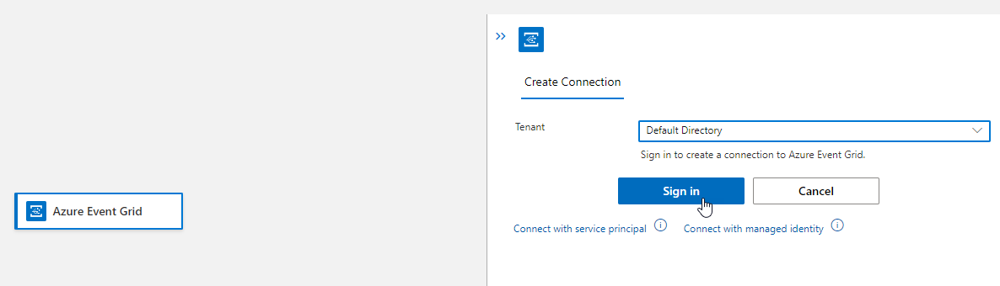  

    Once you've signed in and the connections are created, you can hit the `Continue` button:

    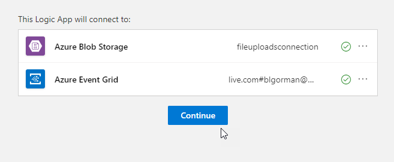  
    
    Once the Logic App is created, you'll notice that it has a bunch of actions already available. 
    
    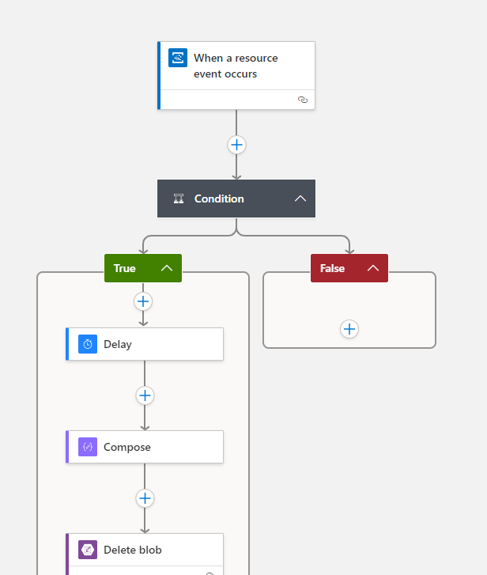

    Delete everything except the trigger connection (leaving only the top connector that says `When a resource event occurs`) Do this by right-clicking on the `Condition` and then selecting `Delete`. 

    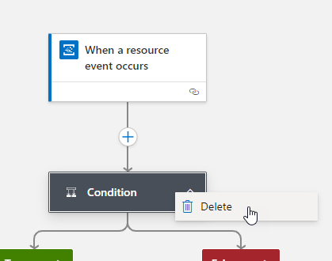  

    Open the `When a resource event occurs` connector, then select the event type `Microsoft.Storage.BlobCreated` from the dropdown:

    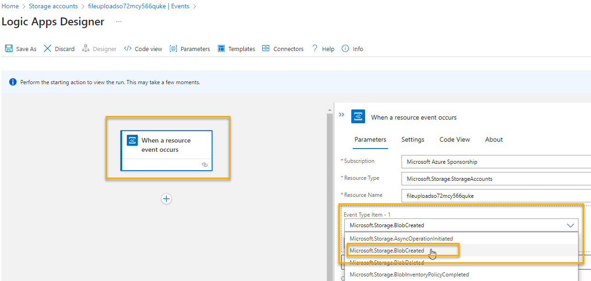  

    Finally, add the prefix filter to only trigger from the specific container within the account by clicking on `Add new parameter`, selecting `Prefix filter` 
    
    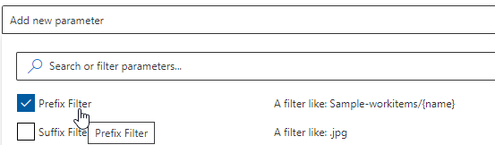  

    Click off the selection, then add the container name `moviestowatch/`:

    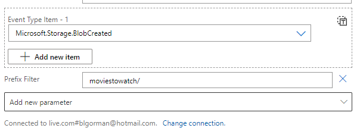  
    
    Save the logic app and name it something like:

    ```text
    ProcessUploadToCosmosSDKFunctionApp
    ```  

    >**Note:** You only get one chance to name a Logic App so be certain of your naming before saving.

    Navigate back to the storage account and just select `OK` when it says you are going to lose your work (provided you saw the save success message).  

## Create the Event to trigger the Bindings Function

Navigate to your Azure Storage Account for uploads.  In that account, at the account level, you'll create the event and wire it up through the Azure Event Grid and point to your Azure Function, which will complete the connection.

1. Open the Azure Storage Account -> Events blade.

    On the events blade, while it's tempting to use the built-in connection (i.e. Trigger Azure Functions), this will work better if you just hit the `+ Event Subscription` Additionally, if you just added the Logic App subscription, you have no choice now but to use this approach (it's better anyway!).  

      

1. Configure the Event Subscription

    Set the Name to something like 
    
    ```text
    RespondToFileUploads
    ```

    Leave the Event Schema to the `Event Grid Schema`. The Event Grid schema is a specific document in JSON format, which includes metadata about the event, including a payload property called 'data' with the 'url' field as called out in the Function App.

    Notice that the Topic Type is the storage account and the resource is your account from which you started this process.  For the System Topic Name, you can enter whatever you would like, so just call it something like:

    ```text
    FileUploadProcessing
    ```  

    Change the `Filter to Event Types` to only respond to `Blob Created` events.

    On the `Endpoint Details`, select `Azure Function` then select the specific function `ParseExcelToCosmosWithBindings` on the `Production` slot for the Function app as you named it.

    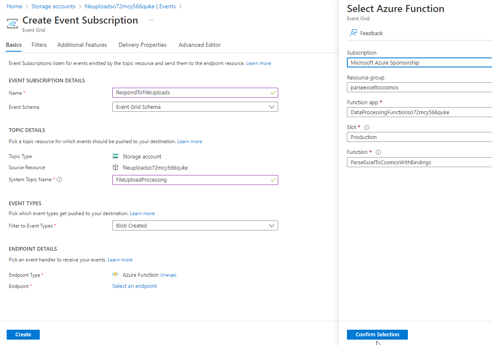   

    Finish the process by clicking `Create` to create the subscription.  When completed, you'll see the details in the Events blade on the storage account:

    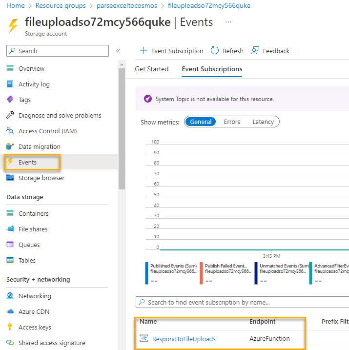  

## Add a filter

Optionally, if you want to ensure that this event is only triggered when files are uploaded to a specific container, you can do this (if you don't, files uploaded to any container will trigger this event, which could have some side effects in walkthrough 05 if you do that one)

1. Open the Event Subscription

    In the storage account events, open the subscription from the link on the `Name` of the event `RespondToFileUploads`.

    Hit the `Filters` tab when it comes up:

    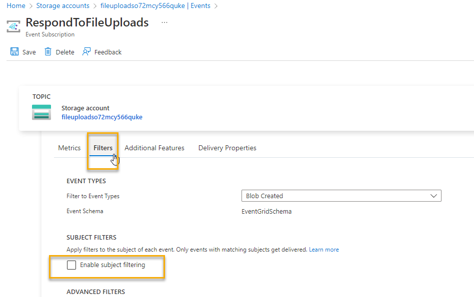  

1. Check the box for enable Subject Filtering

    In the form that appears, enter

    ```text
    /blobServices/default/containers/watchedmovies
    ```  

    This must match the pattern of `/blobServices/default/containers/your-specific-container` to which you are going to upload the excel file.  If you don't get this right, nothing will trigger.

    For the `subject ends with` enter the extension for excel:

    ```text
    .xlsx
    ```  

    In this manner, only excel sheets will trigger the event and only when uploaded to the specific container as named above.

    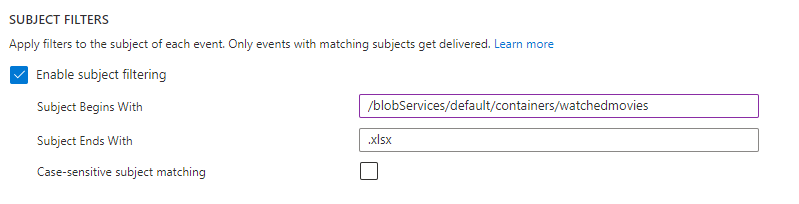  

    >**Note:** Don't forget to save the changes!

## Conclusion

You've now gotten the event subscription wired up with filters in place so that only the correct uploads will trigger the file processing for the Function App.  Optionally, you added the logic app subscription for use in Walkthrough 5 (if you choose to do that). 
