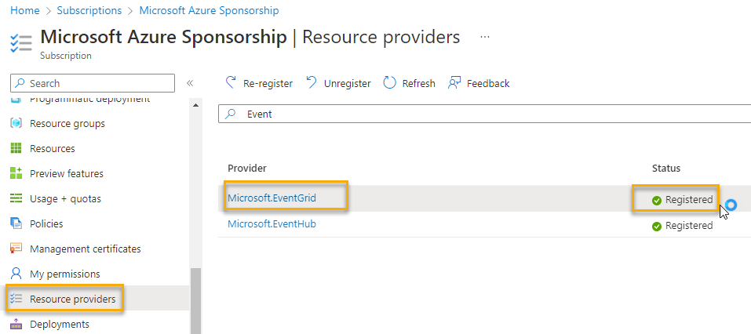
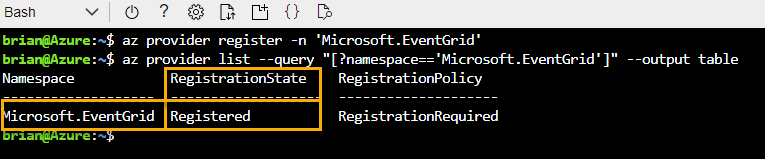
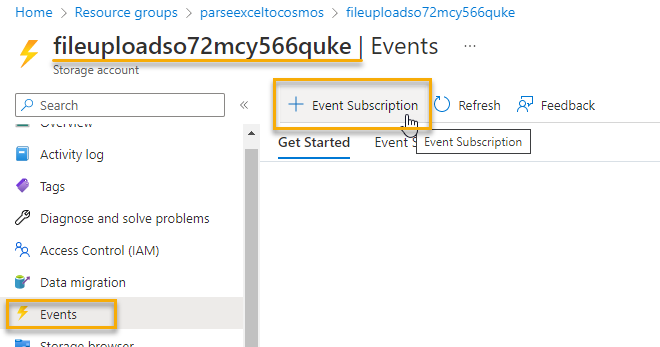
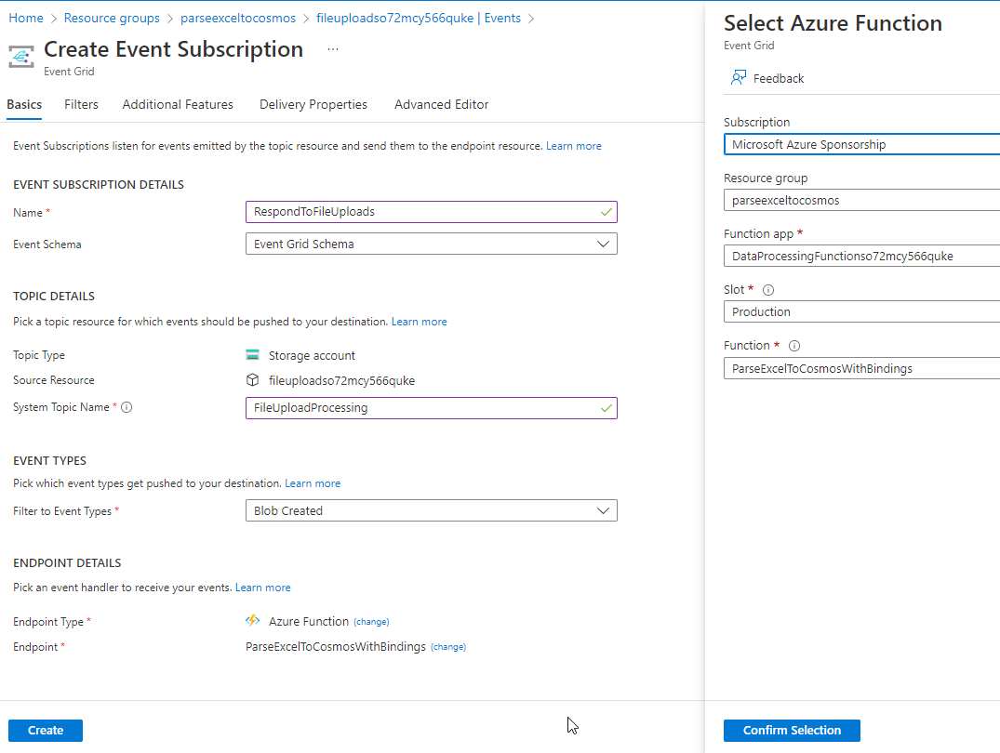
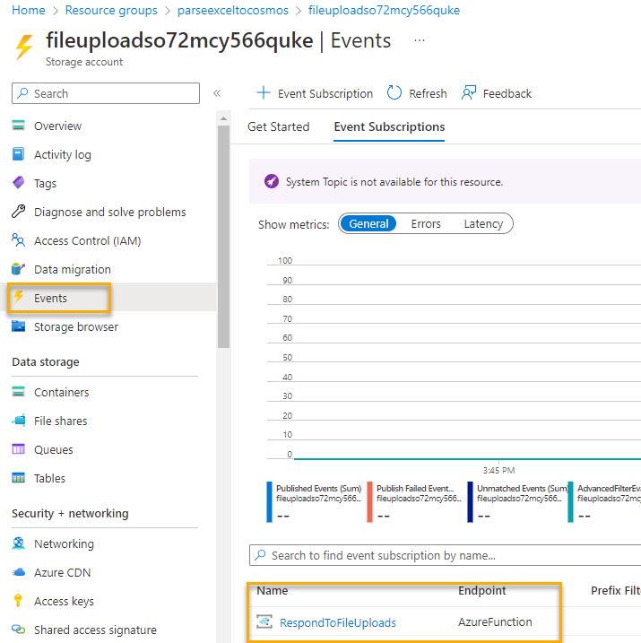

# Wiring up the Event Grid

Now that the Function App is in place to respond to the event, making the Event connection is pretty straightforward.

Just like anything at Azure, you can accomplish this task in multiple ways.  For instance, you can create a default event subscription manually, and then connect the dots to set the source as Blob storage and the destination as any function app, logic app, or even things like Teams channels or other third-party endpoints.

For this example, the easy route will be to leverage the Events blade in the Storage account.

## Register the service

In order to use the Azure Event Grid, you must first register the service.

The easiest way to do this is navigate to your subscription and select the `Resource Providers` blade.

1. Register the service (or validate it is registered)

    On the `Subscription` -> `Resource Providers` blade filter for `Event` to see the two services of `Microsoft.EventGrid` and `Microsoft.EventHub`.  These services are the eventing ecosystem in Azure.

    A couple of quick things:
    - You only need `Microsoft.EventGrid`.  The event hub is for big data and the event grid is for one-off events.  You can ignore EventHub for this activity.
    - Registering for a service does not cost anything.  The only time you incur charges is when you start using the service.  Feel free to turn on all the things, knowing that you won't be charged.

    For this activity, ensure that your `Microsoft.EventGrid` is registered:

      

    Alternatively, you could register the service by just running an azure CLI command in the cloud shell:

    ```bash
    az provider register -n 'Microsoft.EventGrid'
    ```  

    Then you can see if it is registered:

    ```bash
    az provider list --query "[?namespace=='Microsoft.EventGrid']" --output table
    ```  

      

## Create the Event

Navigate to your Azure Storage Account for uploads.  In that account, at the account level, you'll create the event and wire it up through the Azure Event Grid and point to your Azure Function, which will complete the connection.

1. Open the Azure Storage Account -> Events blade.

    On the events blade, while it's tempting to use the built-in connection (i.e. Trigger Azure Functions).  This will work better if you just hit the `+ Event Subscription` 

      

1. Configure the Event Subscription

    Set the Name to something like 
    
    ```text
    RespondToFileUploads
    ```

    Leave the Event Schema to the `Event Grid Schema`. The Event Grid schema is a specific document in JSON format, which includes metadata about the event, including a payload property called 'data' with the 'url' field as called out in the Function App.

    Notice that the Topic Type is the storage account and the resource is your account from which you started this process.  For the System Topic Name, you can enter whatever you would like, so just call it something like:

    ```text
    FileUploadProcessing
    ```  

    Change the `Filter to Event Types` to only respond to `Blob Created` events.

    On the `Endpoint Details`, select `Azure Function` then select the specific function `ParseExcelToCosmosWithBindings` on the `Production` slot for the Function app as you named it.

      

    Finish the process by clicking `Create` to create the subscription.  When completed, you'll see the details in the Events blade on the storage account:

      

## Add a filter

Optionally, if you want to ensure that this event is only triggered when files are uploaded to a specific container, you can do this.

## Conclusion

You've now gotten the event subscription wired up and the last step is to test the solution and see how it responds to the event and processes the files.
