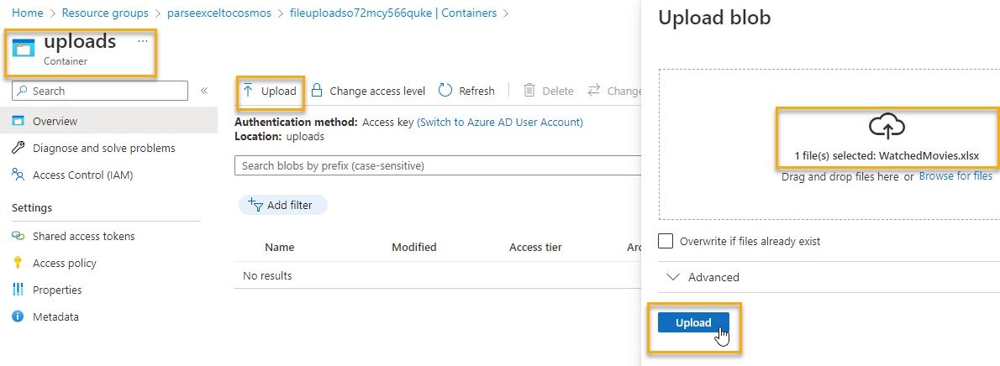
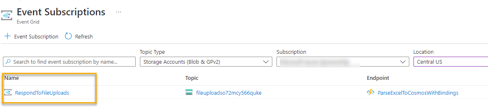
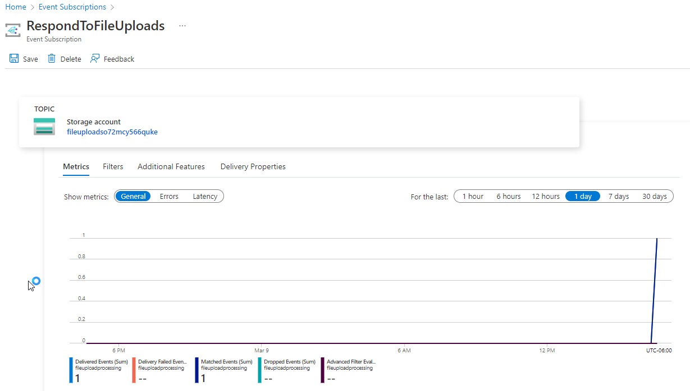
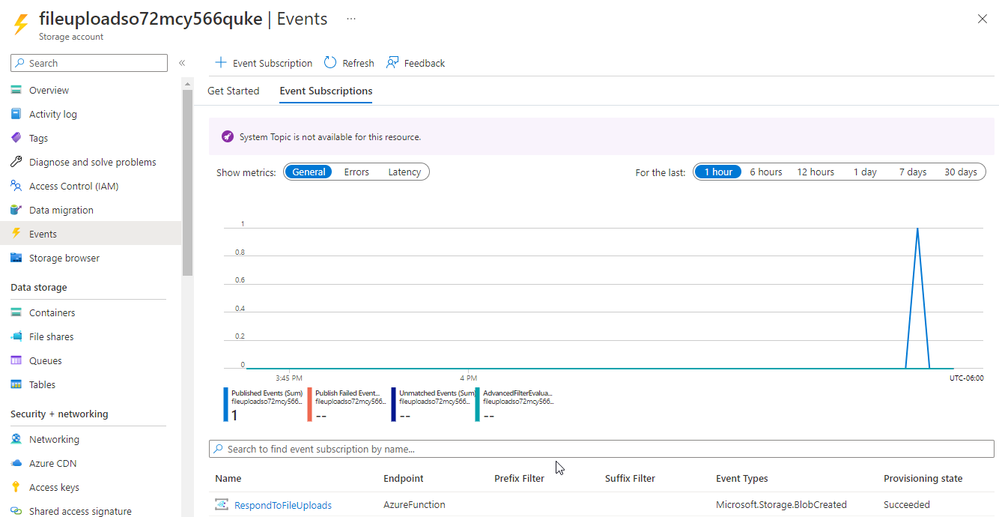
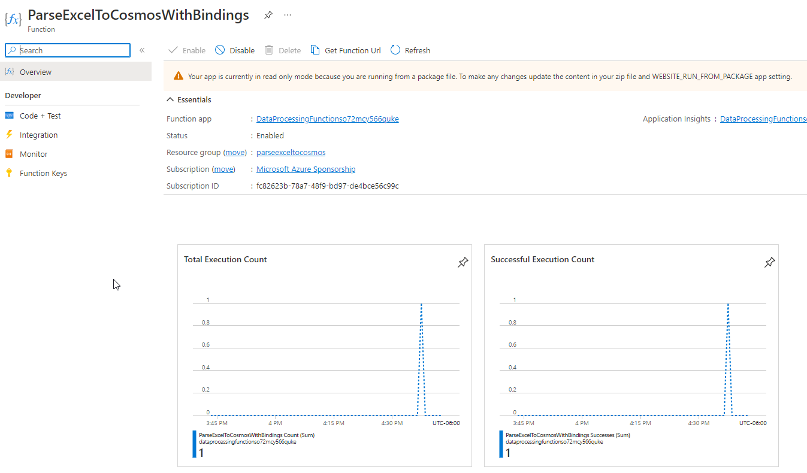
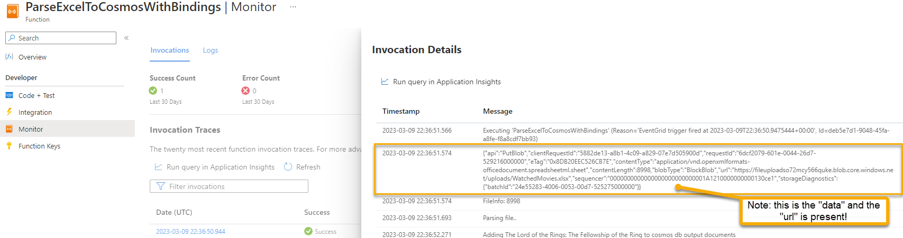

# Process Files

The Function app is ready, cosmos is set up, and the storage account is prepared with the event subscription.

Now, all you need to do is upload a file. There is a sample file provided in the code project as well as in the resources folder at the root of the repository.  

Get a copy of that file ready and modify the data as you see fit.

## Open the storage account in the portal and upload the file

Open your storage account to the `uploads` container and then upload the file.

1. Upload the file

      

    Once the file is uploaded see that it fired the event and the function

## Review the execution

1. Navigate to `Event Subscriptions`

    In the event subscriptions, filter to the type of storage accounts in your subscription and location and then drill into your event subscription:

      

    Then review that it has fired at least once

      

    You can also see it from the storage account:

      

1. Navigate to the Azure Function (may take ~5 minutes to show)

    On the Function app, you can see that the function app has fired:

      

    On the monitor, you can review the execution. Notably, you will be able to see the payload of the event schema:

      

## Review the data in Cosmos

With everything processed, the Excel data should now be fully imported into Cosmos DB.

1. Open the data explorer in Cosmos DB and review the data

## Rinse and Re

