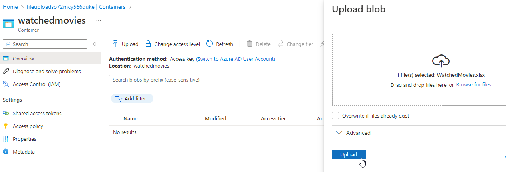
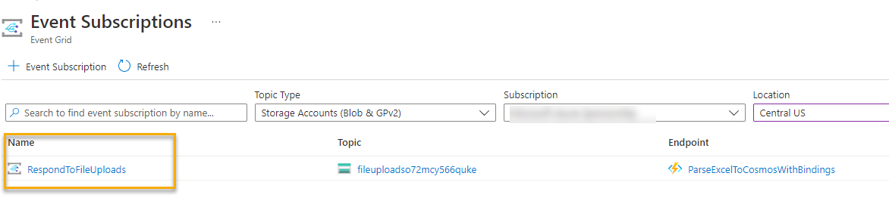
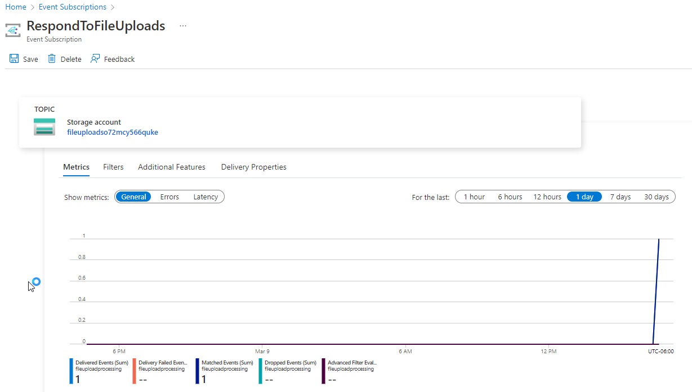
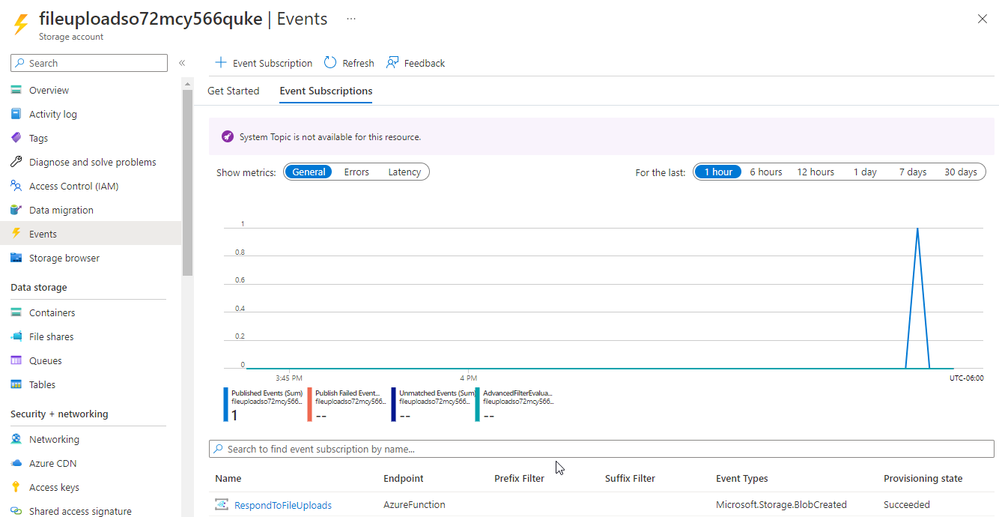
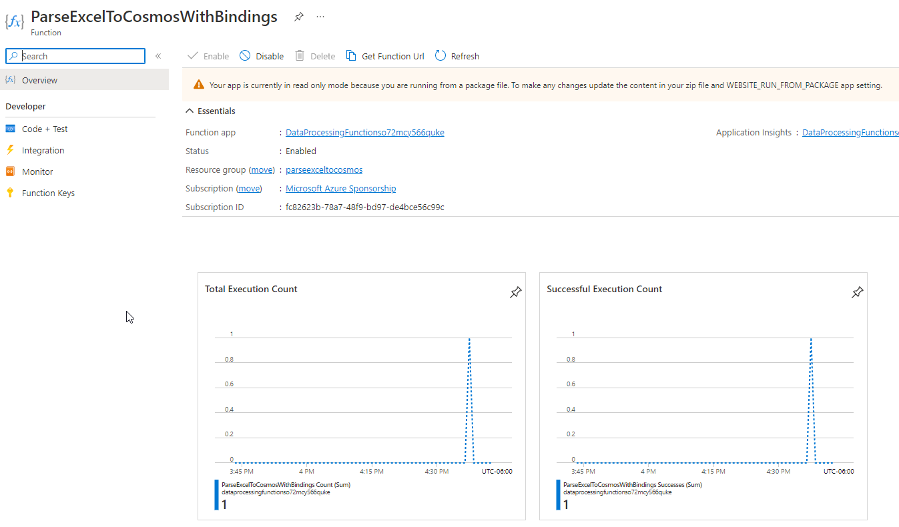
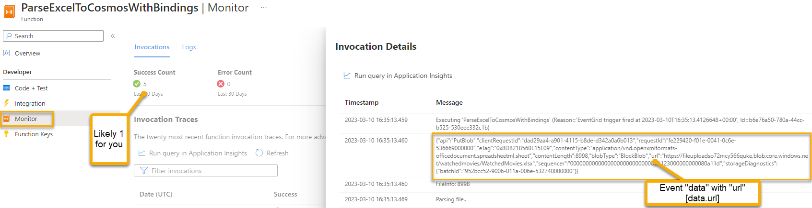
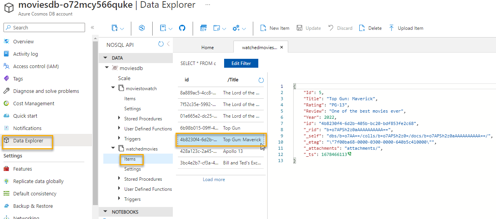

# Process Files

The Function app is ready, cosmos is set up, and the storage account is prepared with the event subscription.

Now, all you need to do is upload a file. There is a sample file provided in the code project as well as in the resources folder at the root of the repository.  

Get a copy of that file ready and modify the data as you see fit.

## Open the storage account in the portal and upload the file

Open your storage account to the `watchedmovies` container and then upload the file.

1. Upload the file

      

    Once the file is uploaded you will be able to see that it fired the event and the function, as long as everything is wired up correctly.

## Review the execution

1. Navigate to `Event Subscriptions`

    In the event subscriptions, filter to the type of storage accounts in your subscription and location and then drill into your event subscription:

      

    Then review that it has fired at least once

      

    You can also see it from the storage account:

      

1. Navigate to the Azure Function (may take ~5 minutes to show)

    On the Function app, you can see that the function app has fired:

       

    On the monitor, you can review the execution. Notably, you will be able to see the payload of the event schema:

      

## Review the data in Cosmos

With everything processed, the Excel data should now be fully imported into Cosmos DB.

1. Open the data explorer in Cosmos DB and review the data

      

## Try to upload something else

Optionally, you can now test the filter.  Try to upload another file that does not end in .xlsx to the `watchedmovies` container and it should not fire.  

Additionally, uploading anything to the `moviestowatch` container should not trigger the event.

## Rinse and Repeat

Feel free to upload the file again.  Due to the use of the `id` you should not get any duplicates on the upload of the data.  

Again, this is important enough to note that you might have to massage your data if you have a regular export that relies on a typical integer `Id` field without the string GUID `id` that is in the sample data.  Once again, the "id" as a random GUID helps to map the data in Cosmos with the "id" and the partition of "Title" to create easy access to your data and the ability to execute the upload multiple times without duplication of data.

## Conclusion

This is the end of the first part of the workshop.  You now have the basic tools to understand how to easily create and wire up events for responding to blob storage with an Azure function.  

You also learned how to use event subject filtering so that the uploaded file will create an event only when in the correct folder and with the correct extension.

In this specific example, you learned how to then get the blob and parse it as an Excel file to put the data into CosmosDB.  There are many other ways you can utilize this process, of course, but hopefully you now have the tools in your belt to make this happen.

In the final walkthrough (which is optional and redundant), you can see a more manual approach to this same type of operation, where you'll utilize the SDKs and an HTTP trigger on the second function.
