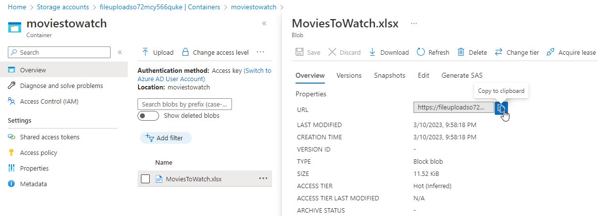
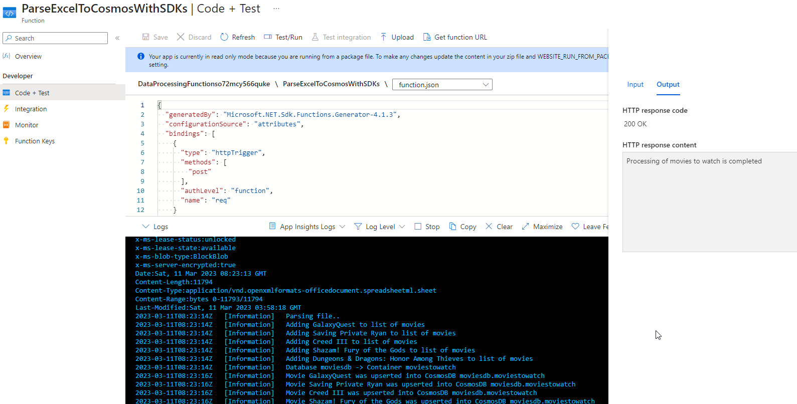
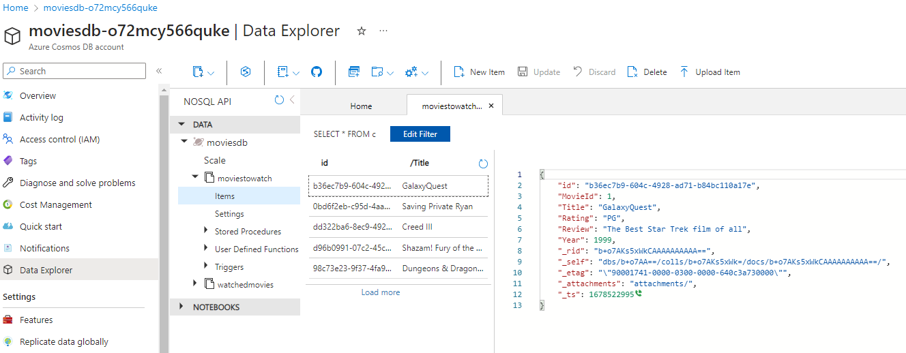

# Recreating the Logic with manual processing

In this optional final walkthrough, you'll get a chance to use an event to fire a logic app.  The logic app will parse the event data and will allow you to process the same event type (Blob Storage Created).

Because logic apps are low-code, you'll need to leverage an Azure Function to work with storage and cosmos to get the file and parse it then process it into cosmos db.

In this example, you will not use any input and output bindings.  Instead, in this example, you'll build manual code to connect to each service and interact via the Azure SDKs for each service (Blob Storage and Cosmos DB).  

## Gather information/Deploy Resources

Assuming you have completed the other parts of this workshop, you should already have the following resources ready to go:

- A storage account for file uploads
- Two containers in the account, one for `watchedmovies` and another for `moviestowatch`
- An event subscription that is filtered to the ``watchedmovies` container and triggers the function `ParseExcelToCosmosWithBindings` in the function app.
- Settings on the function app to have a connection string to the storage account for uploads as well as the cosmos db account (these are critical in this walkthrough).
- Cosmos DB with two containers, one for `watchedmovies` and another for `moviestowatch` in the `moviesdb` database.

For this walkthrough, you'll need the following information handy:

1) The connection string for the Storage Account
1) The connection string for the CosmosDB Account
1) The names as they exist exactly for:
    - The storage container for `moviestowatch`
    - The Cosmos DB database container for `moviestowatch`

You will also need to be able to modify code for the function app, either in VSCode or Visual Studio if you want to manually work through the code in this walkthrough.

If you are limited in resources or don't have this environment, or you just want to validate that your code is correct, you can grab the solution files and deploy them, where all the code is implemented correctly.

>**Note:** Because the code to work with the SDKs is more involved, there are a significant number of code changes necessary to complete this walkthrough.

## Creating the Storage Account Interaction

To get started, the first step is to be able to get files from an Azure Storage Account via the Storage Account Connection string.

If you are storing this in your GitHub, remember to never put your connection string directly in the appsettings.json file, instead, use a usersecrets.json file.

The connection string for the Storage Account should already be available via the configuration blade on the function app.  For this reason, leverage the key exactly in the same manner when retrieving from secrets (unless you want to create a duplicate entry for the connection string on the Function App).  

1. Noting the original functionality

    In the original functionality, the solution just takes a URL to blob storage and gets the data as a stream from a byte array, then passes that stream to the parsing library.

    This code will need to do the same thing via the SDK and then leverage the same tools as before in the function app to do the rest of the work.

    To get this solution to work, the return value from the blob storage interop will be a byte[] and then the function will just leverage the same code to parse the file from there.

1. Compose the Account -> Container -> BlobClient

    Everything in Azure land is a hierarchy, and when you write code against it, you follow that hierarchy.  For this solution, we have a Storage Account -> Container -> Blob hierarchy.

    First the code must connect to the account, then compose the container client, then use the BlobClient to get the blob as a stream.

    If you want to test locally, add a user secret for `uploadsStorageConnection` and set the value to the same connection string used in the previous work to connect to the storage account.

    Create a new folder into the Function App called `BlobStorage` and place a new class called `BlobStorageInterop.cs`.  In the class, add the following code:

    ```c#
    private readonly BlobServiceClient _blobServiceClient;

    public BlobStorageInterop(string connectionString)
    {
        //create account client
        _blobServiceClient = new BlobServiceClient(connectionString);
    }

    public byte[] GetBlob(string containerName, string blobName) 
    {
        //get the specific container into a client
        var containerClient = _blobServiceClient.GetBlobContainerClient(containerName);
        if (containerClient == null)
        {
            throw new Exception($"Container {containerName} not found!");
        }

        var fileToProcess = containerClient.GetBlobClient(blobName);

        if (fileToProcess == null || !fileToProcess.Exists())
        {
            throw new Exception($"Blob {blobName} not found in container {containerName}");
        }

        using (var ms = new MemoryStream())
        {
            fileToProcess.DownloadTo(ms);
            return ms.ToArray();
        }
    }
    ```  

    >**Note:** This client will only get blobs, not upload them, but you could use this logic as a starter to learn more about working with Blob Storage via the SDK if you so desired.

    Additional Note:

    >**Note:** There is no testing here.  If you are concerned about testing, you could create a simple console app and leverage the code to see it working rather than try to shoehorn code into a function app before you are certain that it works.

    Finally, you could just wire this up in the function and avoid the double memory stream byte array jazz.  I moved it to the interop/helper file so that it could potentially be reused.

1. Add the Azure Blob Storage library

    To make this code work, you need to have the NuGet Package `Azure.Storage.Blobs`.  Make sure to import that package into your project if it's not already there.

1. Add a function to get the blob

    The blob URL is passed in, so getting the blob name will require a bit of string manipulation.  Additionally, the connection string needs to be pulled from the configuration.  Add a function to interact with the Blob Storage that can be called from the processing function (added as a new private static method in the same class)

    ```cs
    /// <summary>
    /// Get the file from blob storage
    /// </summary>
    /// <param name="url">The URL of the blob</param>
    /// <param name="log">The Logger for the function</param>
    /// <returns>byte[] containing the file contendts</returns>
    /// <exception cref="Exception">throws exception if any part is bad</exception>
    private static byte[] GetFileToParse(string url, ILogger log)
    {
        var cnstr = Environment.GetEnvironmentVariable("uploadsStorageConnection");
        if (string.IsNullOrWhiteSpace(cnstr))
        {
            log.LogError("Connection string value is not set as expected");
            throw new Exception("Error: Connection string not set or is incorrect");
        }
        var bsi = new BlobStorageInterop(cnstr);

        //get the storage container for uploads
        var containerName = Environment.GetEnvironmentVariable("uploadsStorageContainer");
        if (string.IsNullOrWhiteSpace(containerName))
        {
            log.LogError("Container name value is not set as expected");
            throw new Exception("Error: Container Name is not set");
        }

        //Parse the file after downloading from storage
        var keyText = $@"/{containerName}/";
        var blobNameStart = url.IndexOf(keyText);
        var blobName = url.Substring(blobNameStart + keyText.Length + 1);
        if (string.IsNullOrWhiteSpace(blobName))
        {
            log.LogError("Blob Name not found");
            throw new Exception("Error: Indeterminant blob name");
        }

        //get the blob 
        var fileToParseBytes = bsi.GetBlob(containerName, blobName);
        if (fileToParseBytes == null || fileToParseBytes.Length == 0)
        {
            log.LogError("File Not found");
            throw new Exception($"Error: Blob {blobName} in container {containerName} returned 0 bytes");
        }

        return fileToParseBytes;
    }
    ```  

    Once the method is in place, add a simple command to the main processor function to get the file bytes:

    ```cs
    //Interface with Storage SDK to get data by URL/keys from Azure Storage
    var fileToParse = GetFileToParse(url, log);
    ```  

    >**Reminder:** If you are uncertain about the code as per above, review the solution files in the repository.

1. Parse the file.

    The code to parse the file is already in place.  Make a call similar to the way the bindings function called to the parsefile to parse the byte[] and create a list of movie objects:

    ```cs
    //Parse the file after downloading from storage
    List<Movie> moviesToWatch = new List<Movie>();
    using (var ms = new MemoryStream(fileToParse))
    {
        log.LogInformation("Parsing file..");
        var parseResults = ParseFile.ParseDataFile(ms);
        foreach (var movie in parseResults)
        {
            log.LogInformation($"Adding {movie.Title} to list of movies");
            moviesToWatch.Add(movie);
        }
    }
    ```  

    The movies list will then be able to be processed into the Cosmos DB database.

1. Add the Cosmos DB Interop

    Create a folder called `CosmosDB` and add a file `CosmosDBInterop.cs` to it.

    Add the following code for the interop:

    ```cs
    using Azure.Storage.Blobs;
    using Microsoft.Azure.Cosmos;
    using System;
    using System.Collections.Generic;
    using System.Linq;
    using System.Text;
    using System.Threading.Tasks;

    namespace DataProcessingFunctions.CosmosDB
    {
        public class CosmosDBInterop
        {
            private readonly string _connectionString;
            public CosmosDBInterop(string cnstr) { 
                _connectionString = cnstr;
            }

            public async Task<bool> UpsertMovie(string dbName, string containerName, MovieToWatch m)
            {
                using (CosmosClient client = new CosmosClient(_connectionString))
                {
                    var db = client.GetDatabase(dbName);
                    var container = db.GetContainer(containerName);

                    var movieDoc = await container.UpsertItemAsync(m);

                    return movieDoc != null;
                }
            }
        }
    }
    ```  

    Note that this is very simple code and not at all complete.  One thing you would want to do is ensure you aren't just upserting new items because if the item exists by title you would get the document and use it's id, not the new Guid.  For this training, just getting the initial upsert working is considered a success.

1. Get the parsed data into Comsos DB

    For this next code, you'll put the movie into Cosmos DB.  Start by creating a method to upsert each movie into the correct container.  In this method, note that a new object called `MovieToWatch` is used, because you must pass a string `id` to the cosmos db on create/upsert:

    ```cs
    /// <summary>
    /// Process Movies to watch
    /// </summary>
    /// <param name="movies">The movies to upsert into Cosmos</param>
    /// <param name="log">The Logger object</param>
    private static async Task ProcessMoviesToWatch(List<Movie> movies, ILogger log) 
    {
        var cnstr = Environment.GetEnvironmentVariable("CosmosMoviesDBConnection");
        var cdi = new CosmosDBInterop(cnstr);

        //database
        var dbName = Environment.GetEnvironmentVariable("CosmosMoviesDatabaseName");

        //cosmosMoviesToWatchContainer
        var containerName = Environment.GetEnvironmentVariable("cosmosMoviesToWatchContainer");

        foreach (var m in movies) 
        {
            var movieToWatch = new MovieToWatch()
            {
                MovieId = m.Id,
                Rating = m.Rating,
                Review = m.Review,
                Title = m.Title,
                Year = m.Year,
                id = Guid.NewGuid().ToString()
            };
            var success = await cdi.UpsertMovie(dbName, containerName, movieToWatch);
            string message = success ? $"Movie {m.Title} was upserted into CosmosDB {dbName}.{containerName}"
                                        : $"Movie {m.Title} could not be added to the database";

            log.LogInformation(message);
        }
    }
    ```

    Finish this operation by making a call to the method to process all the movies

    ```cs
    //Interface with Cosmos DB to manually push the documents into Cosmos
    ProcessMoviesToWatch(moviesToWatch, log);
    ```  

    >**Reminder:** If you are uncertain about the code as per above, review the solution files in the repository.

1. Add the missing container information to the function app

    In the code above, two settings were leveraged, and they need to be added to the function app

    - `uploadsStorageContainer`: The name of the storage container where you are uploading files (i.e. `moviestowatch`)
    - `cosmosMoviesDatabaseName`: The name of the database that will be storing the data (i.e. `moviesdb`)
    - `cosmosMoviesToWatchContainer`: The name of the container in cosmos db where you want to push data (i.e. `moviestowatch`)
    
    
  
## Publish and Test 

This is probably a good time to publish the code and test to make sure everything is working before wiring up the automation.

1. Publish the code changes to the Azure Function App

    Right-click and publish or use your CI/CD to publish the function app into your Azure Function App.

1. Open the storage account and upload the sample file for movies to watch.

    The file is included with the solution and in the Resources folder in the root of the repository.

    >**Note:** For simplicity, this is the same structure and file as for the watched movies.  Of course in the real world you can have different files and objects, with different fields.  You would just need to refactor the processor to handle the fields appropriately.
    
1. Once the file is uploaded, get the URL for the blob

    You can get the URL even though you can't access it.  Just open the blob in the portal and copy the URL.
    
     

    The url should be something like (but not exactly like) this:

    ```text
    https://fileuploadso72mcy566quke.blob.core.windows.net/moviestowatch/MoviesToWatch.xlsx
    ```  

    >**Reminder:** That is an example, your link will definitely be a bit different, at least in the account name.

1. Open the function to Code/Test in the portal

    Navigate to the function and open the Code/Test blade, select `Test/Run`, then enter the JSON in the body to send the url:

    ```json
    {
        "url":"https://fileuploadso72mcy566quke.blob.core.windows.net/moviestowatch/MoviesToWatch.xlsx"
    }
    ```  

    >**Note:** use your url of course

      

    Validate that the output shows success:

      

    Validate that the data is in the Cosmos DB

      

1. Once the working code is validated, you won't need to make any further changes to the Azure Function App.

    You can close the code at this point as everything else will be done in Azure.  

## Wire up the automation for Event and Processing

Now that the project is ready to respond with a Function App that has been tested and proven to be able to manually interact with blob storage and the cosmos DB, you are ready to create a trigger and post event.

There are a number of ways you can do this.  For learning purposes, the approach here will be to utilize a logic app to respond to the event and then create a POST with the body holding the blob storage URL.

### Create an Event that Triggers a Logic App

To create the logic app, you'll need to have the storage account name and primary key available.  You'll also need to sign in and authorize the Event with your user id (there are other ways to authorize but this is the easiest by far).

1. Create the Logic App based on a Storage Upload Created Event trigger.

1. Change the logic app to get the data url

1. Post to the azure function endpoint with the payload of the url 

1. Drop a file and see that it is all working

## Conclusion

This wraps up the look at automating events for handling files that are dropped into Azure Storage and then parsing the file with an Azure Function and pushing the data into a Cosmos DB table.
