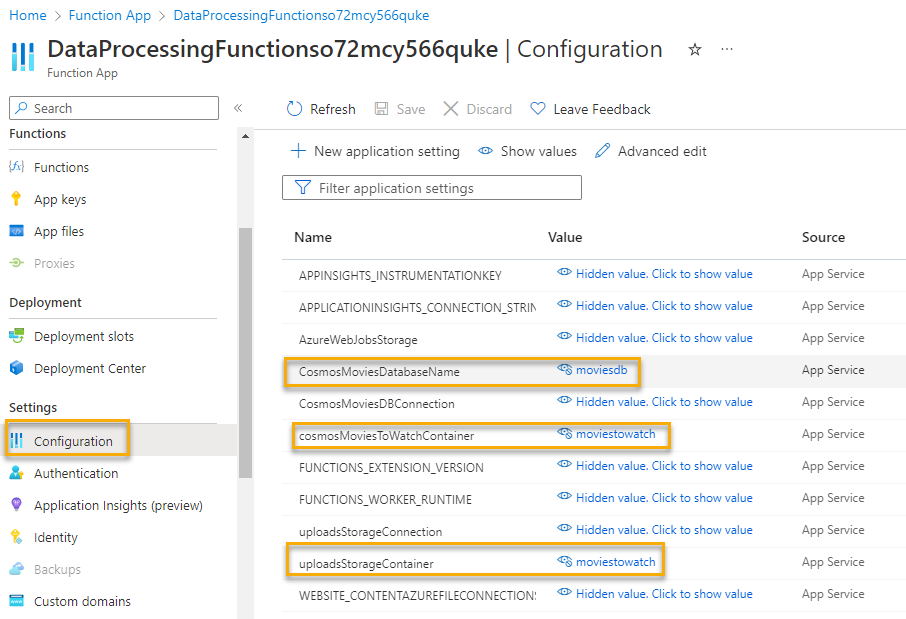
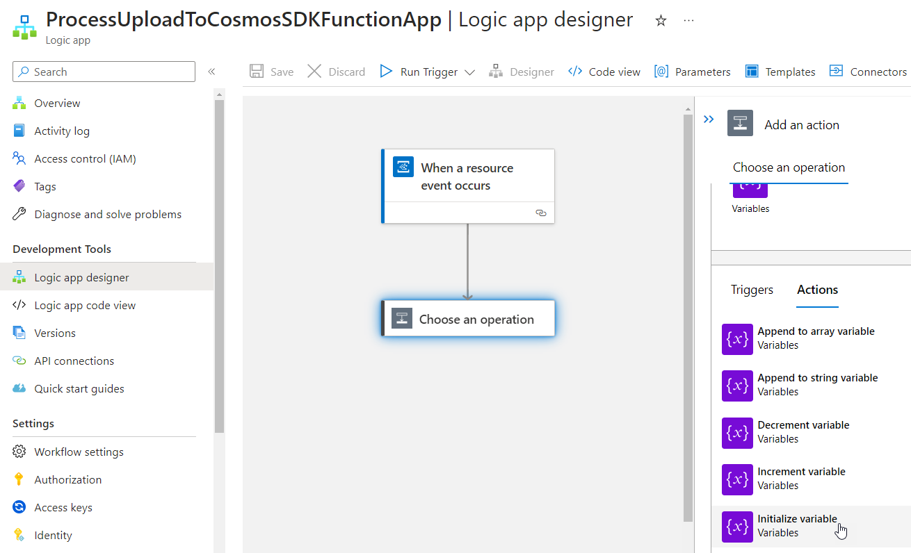

# Recreating the Logic with manual processing

In this optional final walkthrough, you'll get a chance to use an event to fire a logic app.  The logic app will parse the event data and will allow you to process the same event type (Blob Storage Created).

Because logic apps are low-code, you'll need to leverage an Azure Function to work with storage and cosmos to get the file and parse it then process it into cosmos db.

In this example, you will not use any input and output bindings.  Instead, in this example, you'll build manual code to connect to each service and interact via the Azure SDKs for each service (Blob Storage and Cosmos DB).  

## Gather information/Deploy Resources

Assuming you have completed the other parts of this workshop, you should already have the following resources ready to go:

- A storage account for file uploads
- Two containers in the account, one for `watchedmovies` and another for `moviestowatch`
- An event subscription that is filtered to the `watchedmovies` container and triggers the function `ParseExcelToCosmosWithBindings` in the function app.
- Settings on the function app to have a connection string to the storage account for uploads as well as the cosmos db account (these are critical in this walkthrough).
- Cosmos DB with two containers, one for `watchedmovies` and another for `moviestowatch` in the `moviesdb` database.

For this walkthrough, you'll need the following information handy:

1) The connection string for the Storage Account
1) The connection string for the CosmosDB Account
1) The names as they exist exactly for:
    - The storage container for `moviestowatch`
    - The Cosmos DB database container for `moviestowatch`
1) An event subscription with a Logic App already deployed and ready for modification

You will also need to be able to modify code for the function app, either in VSCode or Visual Studio if you want to manually work through the code in this walkthrough.

If you are limited in resources or don't have a useable  environment, or if you just want to validate that your code is correct, you can grab the solution files and deploy them. The solution files contain all the code and it is implemented correctly.

>**Note:** Because the code to work with the SDKs is more involved, there are a significant number of code changes necessary to complete this walkthrough within the Azure Function App.  You'll also need to understand a bit about how JSON works to parse out the data to get the URL in the Logic App.

## Creating the Storage Account Interaction

To get started, the first step is to be able to get files from an Azure Storage Account via the Storage Account Connection string.

If you are storing this code in your GitHub, remember to never put your connection string directly in the `appsettings.json` file, instead, use a `secrets.json` file by utilizing the `Manage User Secrets` option in your .NET project.

The connection string for the Storage Account should already be available via the configuration blade on the Function App.  

For this reason, you will leverage the key exactly in the same manner when retrieving from the secrets file (unless you want to create a duplicate entry for the connection string on the Function App).  

Whereas typically you'd use a hierarchical approach like `StorageAccount:ConnectionString`, this walkthrough will just leverage the existing `uploadsStorageConnection` entry created earlier.  The same will follow for the Cosmos DB connection utilizing the existing entry for `CosmosMoviesDBConnection`.

>**Note:** Additional settings you will encounter in the upcoming code will be added later.  Do not worry if you see code that leverages a setting you have not yet created; you'll get a chance to rectify that before you test the functionality.

1. Noting the original functionality

    In the original functionality, the solution just takes a URL to blob storage and gets the data as a stream from a byte array, then passes that stream to the parsing library.

    This code will need to do the same thing via the SDK and then leverage the same tools as before in the function app to do the rest of the work.

    To get this solution to work, the return value from the blob storage interop is a byte[] and the code for the function will just leverage the same code to parse the file from the byte[].

1. Compose the Account -> Container -> BlobClient

    Everything in Azure-land is a hierarchy, and when you write code against it, you follow that hierarchy.  This pattern holds true for both Storage and the Cosmos DB interactions.  
    
    For this solution, we have a Storage Account -> Container -> Blob hierarchy.

    First the code must connect to the account, then compose the container client, then use the BlobClient to get the blob as a stream.

    If you want to test locally, add a user secret for `uploadsStorageConnection` and set the value to the same connection string used in the previous work to connect to the storage account.

    Create a new folder into the Function App called `BlobStorage` and place a new class called `BlobStorageInterop.cs`.  In the class, add the following code:

    ```c#
    private readonly BlobServiceClient _blobServiceClient;

    public BlobStorageInterop(string connectionString)
    {
        //create account client
        _blobServiceClient = new BlobServiceClient(connectionString);
    }

    public byte[] GetBlob(string containerName, string blobName) 
    {
        //get the specific container into a client
        var containerClient = _blobServiceClient.GetBlobContainerClient(containerName);
        if (containerClient == null)
        {
            throw new Exception($"Container {containerName} not found!");
        }

        var fileToProcess = containerClient.GetBlobClient(blobName);

        if (fileToProcess == null || !fileToProcess.Exists())
        {
            throw new Exception($"Blob {blobName} not found in container {containerName}");
        }

        using (var ms = new MemoryStream())
        {
            fileToProcess.DownloadTo(ms);
            return ms.ToArray();
        }
    }
    ```  

    >**Note:** This client will only get blobs, not upload them, but you could use this logic as a starter to learn more about working with Blob Storage via the SDK if you so desired. 

    You can also find more information in this quickstart document from Microsoft Learn [https://learn.microsoft.com/azure/storage/blobs/storage-quickstart-blobs-dotnet?WT.mc_id=AZ-MVP-5004334](https://learn.microsoft.com/azure/storage/blobs/storage-quickstart-blobs-dotnet?WT.mc_id=AZ-MVP-5004334)  

    Additional Note:

    >**Note:** There is no testing done in this project, including no unit tests.  If you are concerned about testing, you could create a simple console app and leverage the code to see it working rather than try to shoehorn code into a function app before you are certain that it works.  You can also try to run the functions locally and use cURL or PostMan to interact with your function app locally.

    Finally, you could just wire this Storage Account code up in the Function (instead of in a helper class) and avoid the double memory stream byte array jazz.  I moved it to the interop/helper file so that it could potentially be reused by other functions in the future.

1. Add the Azure Blob Storage library

    To make this code work, you need to have the NuGet Package `Azure.Storage.Blobs`.  Make sure to import that package into your project if it's not already there (this should already be included in the starter and solution files).

1. Add a function to get the blob

    The blob URL is passed in, so getting the blob name will require a bit of string manipulation.  Additionally, the connection string needs to be pulled from the configuration.  Add a function to interact with the Blob Storage that can be called from the processing function (added as a new private static method in the same class)

    ```cs
    /// <summary>
    /// Get the file from blob storage
    /// </summary>
    /// <param name="url">The URL of the blob</param>
    /// <param name="log">The Logger for the function</param>
    /// <returns>byte[] containing the file contendts</returns>
    /// <exception cref="Exception">throws exception if any part is bad</exception>
    private static byte[] GetFileToParse(string url, ILogger log)
    {
        var cnstr = Environment.GetEnvironmentVariable("uploadsStorageConnection");
        if (string.IsNullOrWhiteSpace(cnstr))
        {
            log.LogError("Connection string value is not set as expected");
            throw new Exception("Error: Connection string not set or is incorrect");
        }
        var bsi = new BlobStorageInterop(cnstr);

        //get the storage container for uploads
        var containerName = Environment.GetEnvironmentVariable("uploadsStorageContainer");
        if (string.IsNullOrWhiteSpace(containerName))
        {
            log.LogError("Container name value is not set as expected");
            throw new Exception("Error: Container Name is not set");
        }

        //Parse the file after downloading from storage
        var keyText = $@"/{containerName}/";
        var blobNameStart = url.IndexOf(keyText);
        var blobName = url.Substring(blobNameStart + keyText.Length);
        if (string.IsNullOrWhiteSpace(blobName))
        {
            log.LogError("Blob Name not found");
            throw new Exception("Error: Indeterminant blob name");
        }

        //get the blob 
        var fileToParseBytes = bsi.GetBlob(containerName, blobName);
        if (fileToParseBytes == null || fileToParseBytes.Length == 0)
        {
            log.LogError("File Not found");
            throw new Exception($"Error: Blob {blobName} in container {containerName} returned 0 bytes");
        }

        return fileToParseBytes;
    }
    ```  

    Once the method is in place, add a simple command to the main processor function to get the file as a byte[]:

    ```cs
    //Interface with Storage SDK to get data by URL/keys from Azure Storage
    var fileToParse = GetFileToParse(url, log);
    ```  

    >**Reminder:** If you are uncertain about the code as per above, review the solution files in the repository.

1. Parse the file.

    The code to parse the file is already in place.  Make a call similar to the way the `ParseExcelToCosmosWithBindings` function called to the ParseFile.ParseDataFile` code to parse the byte[] and create a list of movie objects:

    ```cs
    //Parse the file after downloading from storage
    List<Movie> moviesToWatch = new List<Movie>();
    using (var ms = new MemoryStream(fileToParse))
    {
        log.LogInformation("Parsing file..");
        var parseResults = ParseFile.ParseDataFile(ms);
        foreach (var movie in parseResults)
        {
            log.LogInformation($"Adding {movie.Title} to list of movies");
            moviesToWatch.Add(movie);
        }
    }
    ```  

    The movies list will then be able to be processed into the Cosmos DB database manually from your Function App.

1. Add the Cosmos DB Interop

    Create a folder called `CosmosDB` and add a file `CosmosDBInterop.cs` to it.

    Add the following code for the interop:

    ```cs
    using Azure.Storage.Blobs;
    using Microsoft.Azure.Cosmos;
    using System;
    using System.Collections.Generic;
    using System.Linq;
    using System.Text;
    using System.Threading.Tasks;

    namespace DataProcessingFunctions.CosmosDB
    {
        public class CosmosDBInterop
        {
            private readonly string _connectionString;
            public CosmosDBInterop(string cnstr) { 
                _connectionString = cnstr;
            }

            //original video code follows:
            public async Task<bool> UpsertMovie(string dbName, string containerName, Movie m)
            {
                using (CosmosClient client = new CosmosClient(_connectionString))
                {
                    var db = client.GetDatabase(dbName);
                    var container = db.GetContainer(containerName);

                    var movieDoc = await container.UpsertItemAsync(m);

                    return movieDoc != null;
                }
            }

            //new code added after video recording for better execution
            public async Task<bool> UpsertMovies(string dbName, string containerName, List<Movie> movies)
            {
                bool success = true;
                using (CosmosClient client = new CosmosClient(_connectionString))
                {
                    var db = client.GetDatabase(dbName);
                    var container = db.GetContainer(containerName);

                    foreach (var m in movies) 
                    {
                        var movieDoc = await container.UpsertItemAsync(m);
                        if (movieDoc is null) 
                        { 
                            success= false; 
                        }
                    }
                }
                return success;
            }
        }
    }
    ```  

    >**Note:** The `CosmosDBInterop` class could be further modified to query and work with the data in the future, including further massaging of the data before insert.  For now, just getting the data into Cosmos is the main goal.

1. Get the parsed data into Comsos DB

    For this next code, you'll put the movie into Cosmos DB.  
    
    Start by creating a method to upsert each movie into the correct container.  In this method, you'll create the new Movie and upsert it via code:

    ```cs
    /// <summary>
    /// Process Movies to watch
    /// </summary>
    /// <param name="movies">The movies to upsert into Cosmos</param>
    /// <param name="log">The Logger object</param>
    private static async Task ProcessMoviesToWatch(List<Movie> movies, ILogger log)
    {
        var cnstr = Environment.GetEnvironmentVariable("CosmosMoviesDBConnection");
        var cdi = new CosmosDBInterop(cnstr);

        //database
        var dbName = Environment.GetEnvironmentVariable("CosmosMoviesDatabaseName");

        //cosmosMoviesToWatchContainer
        var containerName = Environment.GetEnvironmentVariable("cosmosMoviesToWatchContainer");
        log.LogInformation($"Database {dbName} -> Container {containerName}");

        //original video code (do not use, only left this so that you can review the difference):
        /*
        foreach (var m in movies)
        {
            var movieToWatch = new Movie()
            {
                MovieId = m.MovieId,
                Rating = m.Rating,
                Review = m.Review,
                Title = m.Title,
                Year = m.Year,
                id = m.id
            };
            var success = await cdi.UpsertMovie(dbName, containerName, movieToWatch);
            string message = success ? $"Movie {m.Title} was upserted into CosmosDB {dbName}.{containerName}"
                                        : $"Movie {m.Title} could not be added to the database";

            log.LogInformation(message);
        }
        */

        //updated after video walk through to just push all the movies at once:
        var success = await cdi.UpsertMovies(dbName, containerName, movies);

        string message = success ? $"All movies to watch upserted into CosmosDB {dbName}.{containerName}"
                                    : $"Not all movies could be pushed into the database";

        log.LogInformation(message);
    }
    ```

    Finish this operation by making a call to the method to process all the movies

    ```cs
    //Interface with Cosmos DB to manually push the documents into Cosmos
    await ProcessMoviesToWatch(moviesToWatch, log);
    ```  

    >**Reminder:** If you are uncertain about the code as per above, review the solution files in the repository.

1. Add the missing container information to the function app

    In the code above, two settings were leveraged, and they need to be added to the function app

    - `uploadsStorageContainer`: The name of the storage container where you are uploading files (i.e. `moviestowatch`)
    - `cosmosMoviesDatabaseName`: The name of the database that will be storing the data (i.e. `moviesdb`)
    - `cosmosMoviesToWatchContainer`: The name of the container in cosmos db where you want to push data (i.e. `moviestowatch`)
    
    
  
## Publish and Test 

This is probably a good time to publish the code and test to make sure everything is working before wiring up the automation.

1. Publish the code changes to the Azure Function App

    Right-click and publish or use your CI/CD to publish the function app into your Azure Function App.

1. Open the storage account and upload the sample file for movies to watch.

    The file is included with the solution and in the Resources folder in the root of the repository.

    >**Note:** For simplicity, this is the same structure and file as for the watched movies.  Of course in the real world you can have different files and objects, with different fields.  You would just need to refactor the processor to handle the fields appropriately.
    
1. Once the file is uploaded, get the URL for the blob

    You can get the URL even though you can't access it.  Just open the blob in the portal and copy the URL.
    
     

    The url should be something like (but not exactly like) this:

    ```text
    https://fileuploadso72mcy566quke.blob.core.windows.net/moviestowatch/MoviesToWatch.xlsx
    ```  

    >**Reminder:** That is an example, your link will definitely be a bit different, at least in the account name.

1. Open the function to Code/Test in the portal

    Navigate to the function and open the Code/Test blade, select `Test/Run`, then enter the JSON in the body to send the url:

    ```json
    {
        "url":"https://fileuploadso72mcy566quke.blob.core.windows.net/moviestowatch/MoviesToWatch.xlsx"
    }
    ```  

    >**Note:** use your url of course

      

    Validate that the output shows success:

      

    Validate that the data is in the Cosmos DB

      

1. Once the working code is validated, you won't need to make any further changes to the Azure Function App.

    You can close the code at this point as everything else will be done in Azure.  

1. Duplication Prevented

    One last note is that once again with the use of the `id` that is a pre-assigned GUID along with the `Title` as the partition key, you don't have to worry about duplicates getting inserted with the Upsert functionality just making sure any data would be updated or new records would be inserted.

1. Modify the logic app created in step 3

    In this next part, you will modify the Logic App created at the start of the Walkthrough for step 3.

    If you did not do that, then the easiest solution is to just create a new storage account and then add a new Logic App to that new storage account.  

    Another solution is to delete the event subscription from step 3 for the event triggered function and just start fresh on the existing account.  Either way, you can get back to the default state of no subscriptions and follow the steps in Walkthrough 3 to wire up the default Logic App.

1. Get the File URL from the Event Data

    The event data is the same whether it is going to a Function App or a Logic App.

    You could leverage the logs in the Azure Function monitoring from the previous runs, or you can just trigger the Logic App.

    Drill into the `Event Subscription` for the storage account to the Logic App, and modify the `Subject Begins With` filter to the following

    ```text
    /blobServices/default/containers/moviestowatch
    ```  

    Then modify the subject ends with to

    ```text
    .xlsx
    ```  

      

    This is the same thing you did for the other event subscription earlier.

    >**Note:** Make sure to save the changes to deploy the event subscription with the filter.

    Now upload the file again to the `moviestowatch` container to trigger the event that is wired up to launch the Logic App.

    Either way, once you've triggered the Logic App, you can review it by drilling into the Logic App runs:

      

1. Parse out the Event Data URL into a variable

    This is not the most efficient but will show what needs to be done.

    Create a new `Initialize Variable` action in the logic app designer:

      

    Name the Action:

    ```text
    Create the Body to Trigger the Function
    ```  

    Set the name to:

    ```text
    TriggerBody
    ```

    Set the type to `String`

    Then add the Value as

    ```text
    { "url" : "" }
    ``` 

    Replace the empty value text in that string with the Expression for the `Event Data`.
    
    Save your changes.

1. Open the Logic App Code View to modify the data

    The Event Data is not the correct value.  Instead, we really want to send the Event Data ".url" part to the function app.

    In the code view, find the JSON where it says:

    ```json
    "value": "\"{ 'url':'@{triggerBody()?['data']}'}\""
    ```

    Change this value to:

    ```json
    "value": "{ 'url':'@{triggerBody()?['data']['url']}'}"
    ```

    Save the changes and return to the Logic App Designer view.  You should now see the following:

      

    Upload the spreadsheet to trigger the logic app again and make sure this value is set as expected in the review of the executed run:

      


1. Get the function key

    Navigate to your Function App and get the Function Key to trigger the SDK Function:

      

1. Compose the Post to the Azure Function endpoint with the payload of the url

    Add another action for HTTP Post to the Logic app.

    Set the URL to the function execution endpoint retrieved above, something like:

    ```https
    https://dataprocessingfunctionso72mcy566quke.azurewebsites.net/api/ParseExcelToCosmosWithSDKs?code=...==
    ```  

    Set the Body to the variable created in the previous step:

      

1. Optional - delete all the records from the `movies to watch` collection in Cosmos

    If you want to, you can clean up the container.

    You will be able to see the execution once the trigger fires so this is optional.

1. Drop a file into storage to validate that it is all working as expected

    With everything in place, upload the file again.

    Validate that it worked as expected:

      

    And the function shows that it executed:

      


## Conclusion

This wraps up the look at automating events for handling files that are dropped into Azure Storage and then parsing the file with an Azure Function and pushing the data into a Cosmos DB table.

You've now seen how to process the events either from a direct trigger with bindings or via some custom automation.
